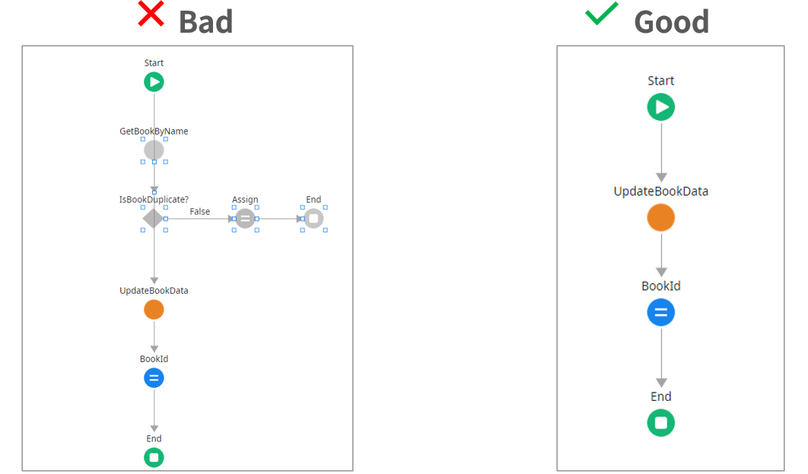
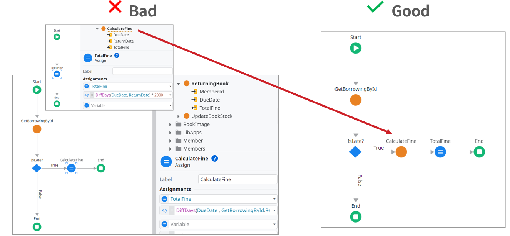
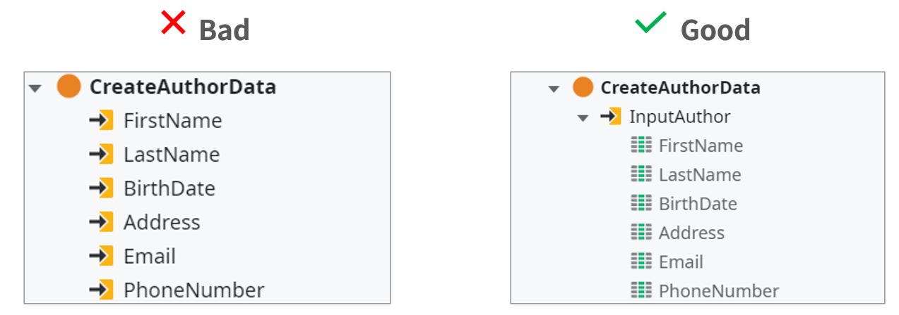
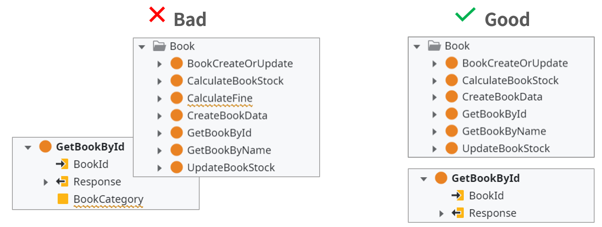
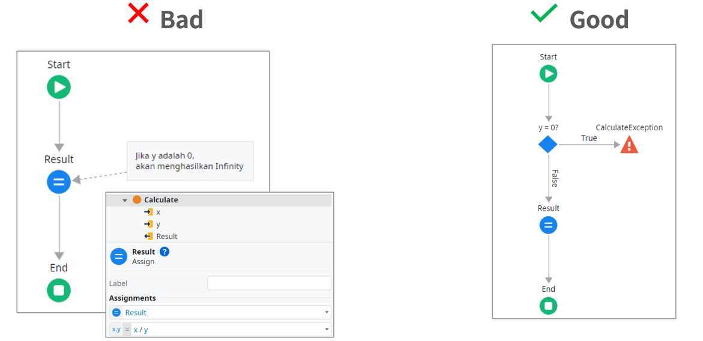
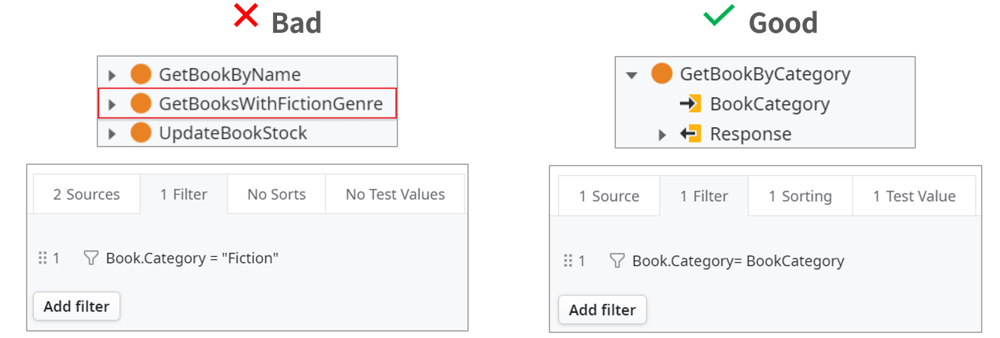
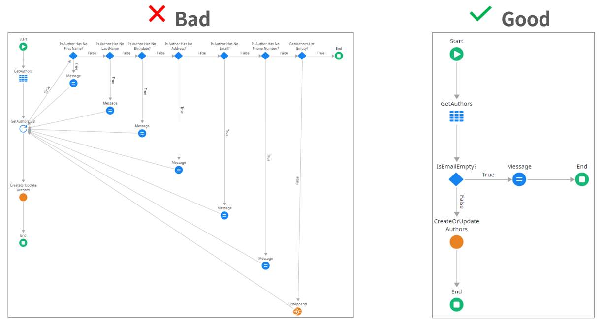

### Apa itu Clean Code?

Dalam dunia pemrograman, menulis kode bukan sekadar membuat program berjalan dengan benar, tetapi juga memastikan bahwa kode tersebut mudah dipahami, dipelihara, dan diperbaiki. Pentingnya menulis kode yang bersih, serta dampak dari kode yang buruk dalam siklus hidup pengembangan perangkat lunak.

---
### Mengapa Clean Code Penting?

Clean code sangat penting dalam pengembangan perangkat lunak karena memberikan banyak manfaat bagi produktivitas tim dan kualitas proyek.

1. **Maintain Fast Productivity**  
    Clean code mudah dibaca dan dimodifikasi, sehingga pengembangan lebih cepat dan efisien. Tim dapat fokus pada inovasi tanpa terhambat oleh kode yang sulit dipahami.  
      
    
2. **It is Costly to Own a Mess**  
    Kode yang berantakan sulit dipelihara dan membutuhkan lebih banyak waktu serta biaya untuk diperbaiki. Hal ini bisa memperlambat pengembangan dan meningkatkan risiko bug.  
      
    
3. **Productivity Decreases**  
    Kode yang buruk membuat tim kesulitan bekerja, memperlambat proses, dan meningkatkan risiko keterlambatan proyek. Jika dibiarkan, ini bisa menyebabkan kegagalan sistem.  
      
    
4. **Happier Developers**  
    Clean code mengurangi stres dan frustrasi, memungkinkan pengembang bekerja lebih nyaman. Hal ini juga meningkatkan semangat kerja dan kolaborasi dalam tim.

---
### Prinsip Clean Code

Clean Code adalah kode yang sederhana, mudah dipahami, dan dapat dipelihara dengan baik. Clean Code bukan hanya sekedar membuat kode berjalan dengan benar, tetapi juga memastikan bahwa kode tersebut dapat dibaca, diuji, dan diperbaiki dengan mudah oleh developer lain di masa depan. Dengan menerapkan prinsip Clean Code, pengembangan perangkat lunak menjadi lebih efisien, mengurangi biaya pemeliharaan, serta meningkatkan produktivitas tim.

Berikut adalah beberapa prinsip utama dalam Clean Code:

1. **Readable**  
    Kode harus mudah dibaca dan dipahami oleh manusia. Ini mencakup pemformatan yang baik, pemilihan nama variabel yang jelas, serta struktur kode yang logis agar alur logika mudah diikuti.
    
2. **Elegant**  
    Kode dibuat dengan indah, sederhana, dan logis tanpa sesuatu yang rumit yang tidak perlu
    
3. **Efficient**  
    Kode dirancang untuk berjalan dengan kinerja yang baik, menggunakan sumber daya (memori, prosesor) secara bijaksana, tanpa mengorbankan keterbacaan atau pemeliharaan.
    
4. **Maintainable**  
    Kode yang baik harus mudah untuk diperbarui, diperbaiki, atau dikembangkan lebih lanjut tanpa menyebabkan masalah pada bagian lain dari sistem. Dengan menjaga struktur yang rapi, developer lain dapat dengan mudah memahami dan memodifikasi kode.
    
5. **Expected**  
    Kode harus berperilaku sesuai dengan harapan pengguna atau pengembang lain. Ini melibatkan mengikuti best practices, coding conventions, dan pola desain yang umum.
    
6. **Manage Dependencies**  
    Hindari penggunaan terlalu banyak pustaka atau framework eksternal kecuali benar-benar diperlukan.
    
7. **Expressive and Self-Documenting**  
    Kode harus mudah dimengerti  dan dapat menjelaskan dirinya sendiri tanpa perlu banyak komentar. Pemilihan nama variabel, fungsi, dan struktur harus jelas mencerminkan maksud dan tujuan kode tersebut dibuat.
    
8. **Testable and Tested**
	- **Testable**: Kode harus dapat diuji dengan mudah dengan  desain kode yang modular sehingga bagian-bagian kecilnya dapat diuji secara independen.
    
	- **Tested**: Kode harus disertai dengan pengujian, baik itu Unit Tests, Integration Tests, maupun end-to-end Tests, untuk memastikan bahwa kode bekerja sesuai harapan.
    

9. **Simple**  
    Kesederhanaan adalah inti dari clean code. Jangan tambahkan kompleksitas yang tidak perlu. Fokus pada penyelesaian masalah dengan cara yang paling mudah dimengerti dan diimplementasikan.
    

---
### Filosofi Clean Code

Setelah mengetahui pentingnya Clean Code, kita akan menyelami bagaimana filosofi yang terdapat di dalam Clean Code  
Clean code bukan hanya tentang menulis kode yang berfungsi, tetapi juga tentang membuatnya lebih mudah dipahami, dipelihara, dan dikembangkan dalam jangka panjang.

1. **Principles and Techniques**  
    Mengikuti aturan dan metode terbaik dalam menulis kode, seperti menggunakan nama yang jelas, menulis Unit Test, serta mengikuti standar pengkodean agar kode lebih mudah dipahami dan dipelihara.  
      
    
2. **Code is a Living Design**  
    Kode harus fleksibel dan mudah dimodifikasi seiring waktu tanpa kehilangan kualitasnya. Desain yang baik memungkinkan perubahan dan penambahan fitur tanpa mengorbankan stabilitas sistem.  
      
    
3. **Treat Writing Code as a Craftsman**  
    Menulis kode dengan teliti dan penuh perhatian seperti seorang pengrajin, menciptakan solusi yang elegan, efisien, dan mudah dipahami oleh tim pengembang lainnya.
   

---
### Apa Itu Bad Code?

Bad Code adalah kode yang sulit dibaca, dipelihara, dan memperlambat pengembangan. Beberapa tanda Bad Code (Code Smell) meliputi:

1. **Komentar buruk** – Tidak relevan, usang, atau berlebihan.
    
2. **Commented Out Code** – Kode yang tidak digunakan tetapi masih ada.
    
3. **Duplication** – Pengulangan kode yang tidak perlu.
    
4. **Too Many Arguments** – Terlalu banyak parameter yang membuat kode sulit dipahami.
    
5. **Dead Code** – Kode yang tidak lagi diperlukan.
    
6. **Incorrect Behavior and Boundaries** – Kode tidak berfungsi dalam kondisi tertentu.
    
7. **Code at Wrong Level of Abstraction** – Abstraksi yang tidak sesuai.
    
8. T**oo Much Information** – Kode mengandung informasi berlebihan yang tidak dibutuhkan.
    

Dengan memahami konsep Clean Code, developer dapat menulis kode yang lebih baik, lebih mudah dipahami, dan lebih mudah dikelola dalam jangka panjang. 

---
### Bahaya Bad Code

Kode yang buruk sering kali muncul karena tekanan waktu, kurangnya perhatian terhadap detail, atau budaya kerja yang tidak mendukung praktik pemrograman yang baik. konsekuensi dari kode yang berantakan:

1. **Produktivitas Menurun:** Seiring waktu, kode yang berantakan menjadi semakin sulit dipahami, menyebabkan pengembang harus menghabiskan waktu lebih lama untuk memahami dan memodifikasinya.  
    
2. **Bug dan Masalah Tak Terduga**:** Kode yang tidak terstruktur cenderung memiliki lebih banyak bug karena ketidakkonsistenan dan kurangnya pemahaman yang jelas tentang bagaimana sistem bekerja.  
      
3. **Ketergantungan yang Kompleks:** Kode yang buruk sering kali memiliki banyak dependensi yang sulit diurai, membuat perubahan kecil pun berisiko menyebabkan kegagalan besar.

Pada akhirnya, kode yang buruk menyebabkan perusahaan kehilangan banyak waktu dan uang dalam perbaikan dan pengembangan ulang.

---
### Jenis-Jenis Bad Code

Sebagai seorang pengembang kita harus membuat kode yang dapat dipahami, baik diri sendiri ataupun orang lain. Berikut adalah beberapa bad code yang harus dihindari : 

1. **Obsolete, Redundant, and Poorly Written Comments**  
    Komentar dalam kode harus membantu pengembang lain memahami maksud dan fungsi kode. Namun, jika komentar sudah usang (tidak lagi relevan dengan kode yang diperbarui), berlebihan (menjelaskan hal yang sudah jelas dari kode itu sendiri), atau ditulis dengan buruk (tidak jelas atau membingungkan), maka justru akan menghambat pemahaman. 
       
	
	
    
1. **Commented Out Code**  
    Kode yang dinonaktifkan tetapi masih dibiarkan dalam proyek bisa menimbulkan kebingungan dan memperumit pemeliharaan. Developer lain bisa bingung apakah kode tersebut masih dibutuhkan atau tidak. Jika suatu kode memang tidak diperlukan lagi, lebih baik dihapus.

      

2. **Duplication**  
    Pengulangan kode yang tidak perlu dapat menyulitkan pemahaman logika, memperlambat proses perubahan, dan menurunkan efisiensi serta kinerja perangkat lunak.  

	
      
    
3. **Too Many Arguments**  
    Pengulangan kode secara tidak perlu bisa menyebabkan kesulitan dalam pemeliharaan. Jika ada perubahan yang perlu dilakukan, maka semua bagian yang duplikat harus diperbarui, yang bisa meningkatkan risiko kesalahan. Lebih baik menggunakan fungsi atau metode untuk menghindari duplikasi kode.  

	
    
4. **Dead Code**  
    Dead code adalah kode yang tidak pernah dieksekusi atau tidak memiliki dampak apa pun dalam aplikasi. Ini bisa terjadi karena perubahan dalam proyek yang membuat kode tersebut tidak lagi diperlukan. Keberadaan dead code bisa membingungkan dan sebaiknya dihapus.  
      
    
    
5. **Incorrect Behavior and Boundaries**  
    Kode yang tidak menangani semua kemungkinan kasus atau batasan (boundary cases) dengan benar dapat menyebabkan bug atau hasil yang tidak diharapkan. Kesalahan bisa muncul saat kode tidak mempertimbangkan input yang tidak biasa atau skenario ekstrem.

  

	
6. **Code at Wrong Level of Abstraction**  
    Jika kode terlalu spesifik pada tingkat abstraksi yang tinggi, atau terlalu umum di tingkat yang rendah, maka akan sulit dipelihara dan dipahami.  
    
	   
      
    
7. **Too Much Information**  
    Kode yang terlalu banyak informasi bisa sulit dibaca dan dipahami, karena mengandung lebih banyak detail dari yang diperlukan. Ini bisa terjadi jika ada terlalu banyak komentar, log yang tidak relevan, atau terlalu banyak dependensi yang tidak diperlukan.
    
    

---
### Kesimpulan

Clean Code adalah konsep penting dalam pengembangan perangkat lunak yang bertujuan untuk membuat kode yang mudah dipahami, dipelihara, dan diperbaiki. Dengan menerapkan prinsip-prinsip Clean Code seperti keterbacaan, efisiensi, dan keterpeliharaan, developer dapat meningkatkan produktivitas serta mengurangi biaya perawatan jangka panjang.

Sebaliknya, Bad Code dapat memperlambat pengembangan, meningkatkan risiko bug, dan menyulitkan pemeliharaan. Beberapa tanda Bad Code yang harus dihindari meliputi komentar buruk, kode yang dinonaktifkan tetapi masih ada, duplikasi kode, terlalu banyak parameter, dead code, perilaku yang salah, abstraksi yang tidak sesuai, dan informasi yang berlebihan dalam kode.

Dengan memahami konsep Clean Code dan menghindari Bad Code, developer dapat menulis kode yang lebih efisien, mudah dibaca, dan berkontribusi pada pengembangan perangkat lunak yang berkualitas tinggi.
