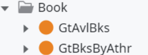
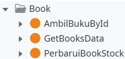

## Intorduction Meaningful Names

Salah satu aspek terpenting dalam menulis kode yang bersih (Clean Code) adalah penggunaan **Meaningful Names** atau nama yang bermakna. Nama yang baik akan meningkatkan keterbacaan kode, mempermudah pemeliharaan, dan mengurangi kemungkinan kesalahan akibat ketidakjelasan dalam penamaan variabel, fungsi, atau kelas.

---
## Definisi Meaningful Names

**Apa itu Meaningful Names?**  
Meaningful Names adalah nama yang jelas, deskriptif, dan mencerminkan tujuan elemen dalam kode. Elemen kode ini dapat berupa variabel, fungsi, metode, kelas, atau modul.

**Contoh perbandingan:**

```
❌ Bad Name: a, b, temp
```

Pada contoh Bad Name diatas, nama variabel seperti a, b, dan temp tidak memberikan informasi yang jelas mengenai tujuan atau maknanya. Ini bisa membingungkan bagi orang lain yang membaca kode atau bahkan diri sendiri di masa depan.  
  
```
✅ Good Name: totalPrice, customerName, loanAmount
```

Pada contoh Good Name diatas, nama variabel lebih deskriptif dan mencerminkan fungsinya, sehingga kode lebih mudah dibaca dan dipahami.

Dengan menggunakan Meaningful Names, kode akan lebih mudah dipahami oleh programmer lain, termasuk oleh diri sendiri di masa depan.

---
## Pentingnya Meaningful Names

Mengapa Meaningful Names sangat penting dalam pengembangan perangkat lunak? Berikut beberapa alasannya:
#### 1. Mengurangi Ambiguitas

Nama yang tidak jelas dapat membingungkan programmer lain yang membaca kode. Dengan menggunakan nama yang deskriptif, kita bisa menghindari kesalahpahaman dan meningkatkan kejelasan kode.

#### 2. Meningkatkan Keterbacaan (Readability)

Kode yang mudah dibaca akan lebih mudah dipahami. Ini akan mempercepat proses pengembangan dan debugging.

#### 3. Memudahkan Pemeliharaan (Maintenance)

Kode yang memiliki penamaan yang jelas akan lebih mudah diperbaiki atau diperbarui di masa mendatang, terutama jika dikerjakan oleh tim yang berbeda.

#### 4. Mempercepat Kolaborasi (Collaborate)

Dalam tim pengembangan, penamaan yang baik mempermudah komunikasi antar anggota tim dan mempercepat proses kerja.

#### 5. Mencerminkan Profesionalisme

Kode dengan penamaan yang rapi mencerminkan tingkat profesionalisme seorang developer. Hal ini juga memudahkan onboarding bagi anggota tim baru.

---
## Prinsip Meaningful Names

Berikut adalah beberapa prinsip dalam menamai elemen kode dengan Meaningful Names:

### 1. Intention-Revealing Names

Nama harus menjelaskan tujuan dari variabel atau fungsi tersebut.

**Contoh:**

❌ **Bad Example – GetBookByName**  


- **Id**: Seharusnya inputnya adalah **Name**, karena fungsi ini mencari buku berdasarkan nama, bukan ID. Lalu, nama ini kurang jelas karena tidak menjelaskan bahwa ini adalah ID buku.
- **Record**: Nama ini terlalu umum dan tidak menjelaskan bahwa ini adalah data buku.


```
✅ Good Example – GetBookById
```


- **BookId** → Input parameter ini sesuai karena fungsi mencari buku berdasarkan **ID**, bukan berdasarkan nama.
- **BookRecord** → Nama ini lebih deskriptif karena menunjukkan bahwa hasilnya adalah rekaman data buku.  


### 2. Avoid Disinformation

Jangan menggunakan nama yang bisa menyesatkan atau memberikan informasi yang salah.

**Contoh:**

```
❌ Bad Example – GetBookAndMemberDetails
```


- Nama fungsi ini menyiratkan bahwa fungsi akan mengambil **detail buku dan detail anggota.**
- Namun, berdasarkan hasilnya, fungsi ini hanya mengembalikan **BookDetails** tanpa informasi tentang anggota.
- Ini bisa membingungkan bagi developer lain yang menggunakannya, karena mereka mungkin mengira akan mendapatkan informasi tentang anggota juga.


```
✅ Good Example – GetBookDetails
```


- Nama ini lebih akurat karena fungsi memang hanya mengembalikan **BookDetails**.
- Menghindari disinformasi dan membuat kode lebih mudah dipahami.  

### 3. Pronounceable Names

Gunakan nama yang mudah diucapkan agar mudah didiskusikan dalam tim.

**Contoh:**

```
❌ Bad Example – GtAvlBks, GtBksByAthr
```



- Nama ini menggunakan singkatan yang sulit dibaca dan dipahami dengan cepat.
- Sulit diucapkan dalam diskusi tim, misalnya, developer mengatakan "Coba cek fungsi **GtAvlBks**", hal ini bisa membingungkan.
- Mengurangi keterbacaan kode dan meningkatkan kemungkinan kesalahan pemahaman.


```
✅ Good Example – GetAvailableBooks, GetBookByAuthor
```


- Nama ini lebih jelas dan mudah dibaca serta diucapkan.
- Developer lain bisa langsung memahami fungsinya tanpa perlu menebak-nebak.
- Memudahkan komunikasi dalam tim dan meningkatkan keterbacaan kode.    

### 4. Searchable Names

Gunakan nama yang mudah dicari dalam kode agar mempercepat debugging dan pemeliharaan.

**Contoh:**

```
❌ Bad Example – Action1, Action2
```


- Nama ini tidak memberikan informasi jelas tentang fungsi yang dilakukan.
- Developer lain harus membuka implementasi untuk memahami tujuannya.
- Sulit dicari di dalam kode karena terlalu umum dan tidak deskriptif.


```
✅ Good Example – GetMemberByName, GetMembersData
```

- Nama ini langsung memberikan informasi tentang apa yang dilakukan fungsinya.
- Mudah dicari dalam kode menggunakan fitur pencarian.
- Meningkatkan keterbacaan dan memudahkan debugging serta pemeliharaan.  
   
### 5. Don’t Be Cute

Hindari nama yang lucu atau tidak profesional.

**Contoh:**

```
❌ Bad Example – GetBooksMagic, UpdateMyLittleBookStocks
```


- Nama ini terlalu imajinatif dan tidak langsung menggambarkan fungsinya.
- Bisa membingungkan developer lain yang membaca kode.
- Tidak terdengar profesional dalam lingkungan kerja.


```
✅ Good Example – GetBooksData, UpdateBookStock
```


- Nama ini lebih deskriptif dan langsung menyatakan tujuan fungsinya.
- Mudah dimengerti oleh tim pengembang.
- Mengikuti standar penamaan yang lebih profesional.     

### 6. Pick One Word per Concept

Konsisten dalam memilih kata untuk suatu konsep tertentu di seluruh kode.

**Contoh:**

```
❌ Bad Example – AmbilBukuById, GetBooksData, PerbaruiBookStock
```


- Menggunakan campuran bahasa Indonesia dan Inggris (**AmbilBukuById** dan **GetBooksData**).
- Menggunakan kata yang tidak konsisten untuk konsep yang sama (**PerbaruiBookStock** vs. **UpdateBookStock**).
- Bisa membingungkan developer lain karena variasi istilah dalam satu proyek.


```
✅ Good Example – GetBookById, GetBooksData, UpdateBookStock
```


- Semua istilah dalam bahasa Inggris.
- Konsisten dalam memilih kata kerja (**Get, Update**).
- Memudahkan pembacaan dan pemeliharaan kode dalam tim.  
   
### 7. Add Meaningful Context

Tambahkan konteks yang bermakna agar lebih jelas.

**Contoh:**

```
❌ Bad Example – Validate
```


- Terlalu umum, tidak jelas apa yang divalidasi.
- Membuat kode sulit dipahami tanpa melihat implementasinya.


```
✅ Good Example – ValidateCustomerOrder
```


- Menambahkan konteks (**CustomerOrder**), sehingga lebih jelas apa yang divalidasi.
- Memudahkan pembacaan dan pemeliharaan kode.     

### 8. Don’t Add Gratuitous Context

Jangan menambahkan konteks yang tidak perlu.

**Contoh:**

```
❌ Bad Example – GetLibrarySystemBookDetailsBasedOnBookId
```


- **GetLibrarySystemBookDetailsBasedOnBookId** → Terlalu panjang dan berlebihan.
- **InputBookIdentifierForTheLibrarySystem** → "ForTheLibrarySystem" tidak perlu.
- **OutputBookInformationDetailsOfTheLibrarySystem** → Terlalu deskriptif, bisa disederhanakan.


```
✅ Good Example – GetBookDetails
```


- **GetBookDetails** → Langsung ke inti tanpa informasi berlebihan.
- **BookId** → Lebih ringkas daripada **InputBookIdentifierForTheLibrarySystem**.
- **BookDetails** → Nama yang sudah cukup jelas tanpa tambahan kata yang tidak perlu.  


### 9. Using Solution Domain Names

Gunakan istilah teknis atau konsep yang umum dalam dunia pemrograman.

**Contoh:**

```
❌ Bad Example – GetUserSementara
```


- Penggunaan istilah "*Sementara*" kurang jelas dalam konteks teknis.
- **DataPenggunaSementara** juga terdengar seperti bahasa sehari-hari, bukan istilah teknis yang sering digunakan.


```
✅ Good Example – GetSessionUser
```


- Menggunakan istilah yang sudah dikenal dalam pemrograman seperti Session.
- **SessionUser** lebih ringkas dan langsung menggambarkan maksudnya.  


### 10. Using Problem Domain Names

Gunakan istilah yang sering mencerminkan kebutuhan klien agar lebih mudah dipahami.

**Contoh:**

```
❌ Bad Example – SaveInfo
```


- Terlalu umum dan tidak jelas.
- "Info" bisa berarti banyak hal, sehingga sulit dipahami konteksnya.


```
✅ Good Example – SaveTransactionDetails
```


- Lebih spesifik dan menggambarkan apa yang benar-benar disimpan.
- Memudahkan developer dan stakeholder memahami fungsinya.

---
## Konsekuensi Penamaan yang Buruk

Jika kita menggunakan penamaan yang buruk dalam kode, akan ada beberapa konsekuensi negatif:

1. **Membingungkan pengembang lain (atau diri sendiri di masa depan)** – Sulit memahami tujuan dari suatu variabel atau fungsi.

2. **Meningkatkan risiko bug karena kesalahpahaman** – Misinterpretasi dari kode dapat menyebabkan error yang sulit dideteksi.

3. **Memperlambat pengembangan dan debugging** – Developer harus menebak-nebak arti dari suatu nama variabel atau fungsi.

4. **Menambah biaya pemeliharaan (maintenance)** – Butuh waktu lebih lama untuk memperbaiki atau memperbarui kode.

---
## Panduan Penamaan

Berikut adalah beberapa aturan dasar dalam menamai elemen kode:
### 1. Terapkan Pascal, Snake, dan Camel Case

- **PascalCase**: Huruf pertama setiap kata dikapitalisasi (**CustomerManager**)
    
- **camelCase:** Huruf pertama kecil, kata berikutnya dikapitalisasi (**getUserData**)
    
- **snake_case**: Semua huruf kecil, kata dipisahkan dengan underscore (**MAX RECORDS**)
    

### 2. Gunakan Kata Kerja (Verb) untuk Fungsi

Fungsi (method) harus mencerminkan aksi yang dilakukan, sehingga diawali dengan kata kerja (verb). Format umum:

```
Verb + Object

Verb + Object + Prefix
```

**Contoh:**
```
❌ Salah: UsersGet, CustomerSave, Customer_Delete
```

- Urutan kata kurang tepat. Kata "**Users**" dan "**Customer**" adalah **kata benda (noun)**, yang tidak menunjukkan aksi.
- Fungsi seharusnya diawali dengan **kata kerja (verb)** seperti "**Get**", "**Save**", dan "**Delete**" agar jelas apa yang dilakukan.
    
```
✅ Benar: GetUserData, SaveInvoice, DeleteCustomer
```

- Urutan kata sudah tepat karena diawali dengan **kata kerja (verb)**, sehingga jelas bahwa fungsi ini melakukan aksi tertentu.

### 3. Gunakan Kata Benda (Noun) untuk Variabel/Parameter

Variabel menyimpan nilai atau objek, sehingga sebaiknya dinamai dengan kata benda agar lebih deskriptif. Format umum:

```
Noun + Object

Noun + Object + Prefix
```

**Contoh:**
```
❌ Salah: Get_userList, listUsers, GetCustomerData
```

- **Get_userList**→ Mengandung kata kerja "**Get**", yang lebih cocok untuk fungsi daripada variabel.

- **listUsers** → Urutan kata kurang tepat. Seharusnya "**userList**", karena variabel ini menyimpan daftar pengguna, bukan aksi untuk menampilkan daftar pengguna.

- **GetCustomerData** → Mengandung kata kerja "**Get**", yang lebih cocok untuk fungsi daripada variabel. Variabel sebaiknya hanya berisi kata benda yang menjelaskan data yang disimpan.


```
✅ Benar: UserData, transactionDetails, customerInfo
```

- Menggunakan kata benda (noun) yang mendeskripsikan isi variabel dengan lebih jelas.

- "**UserData**" → Menyimpan data pengguna.
 
- "**transactionDetails**" → Menyimpan detail transaksi.

- "**customerInfo**" → Menyimpan informasi pelanggan.
   
- Tidak mengandung kata kerja sehingga lebih sesuai sebagai nama variabel.

---
## Kesimpulan

Meaningful Names adalah dasar dari clean code. Dengan memberikan nama yang jelas dan deskriptif, kita dapat membuat kode yang lebih mudah dibaca, dipelihara, dan dikembangkan. Praktik ini meningkatkan efisiensi tim dan mengurangi kemungkinan error dalam pengembangan perangkat lunak.

> ***Good code starts with good naming!***
