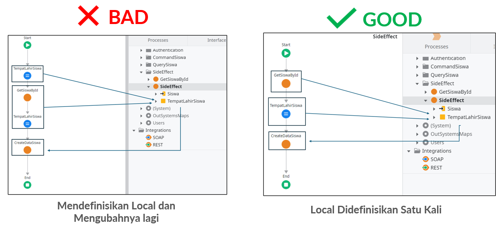
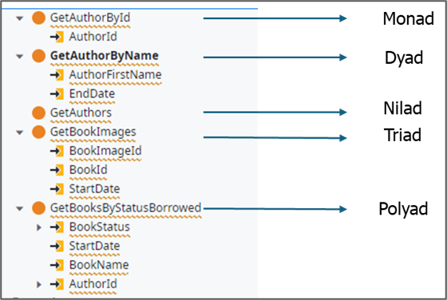
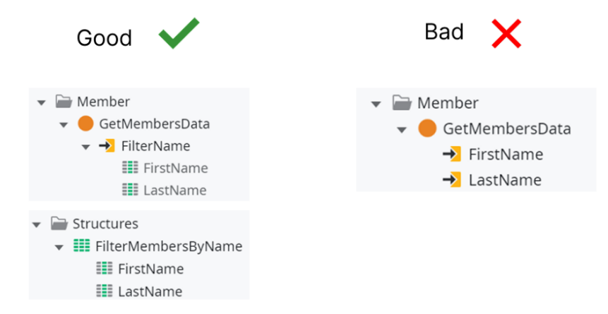
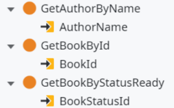
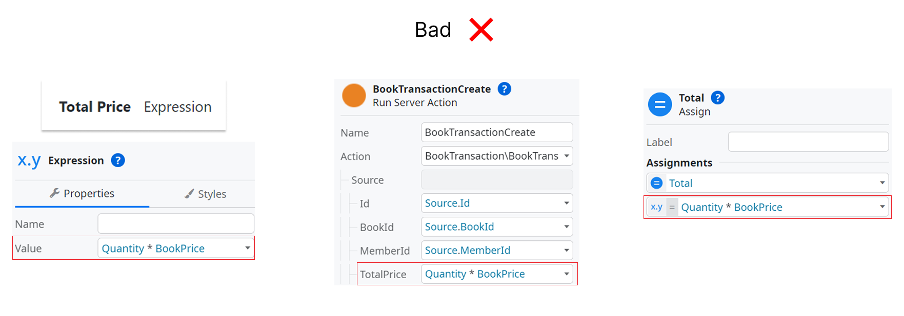
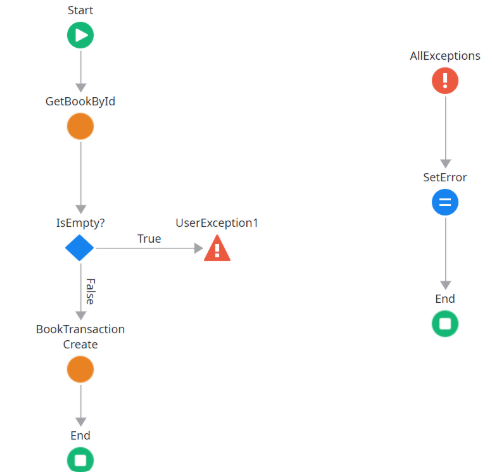
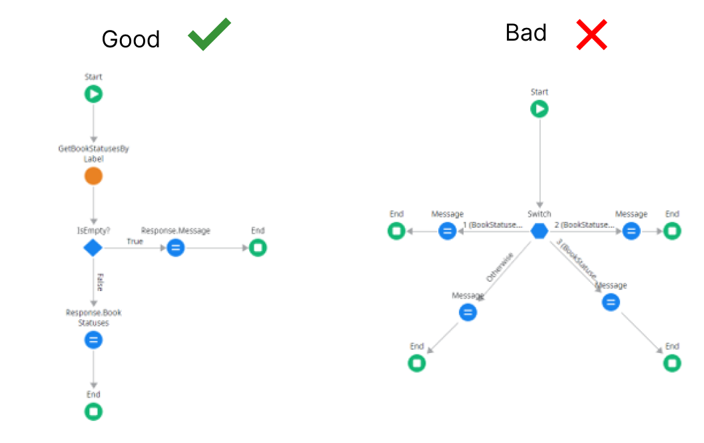
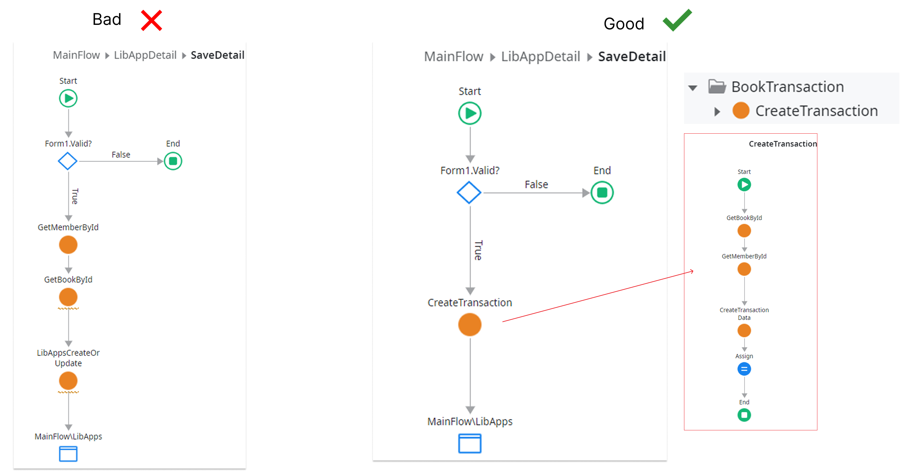
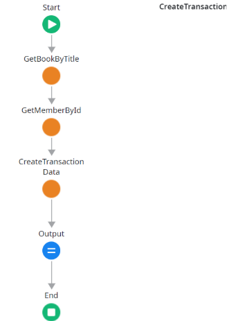

## Introduction

Dalam pengembangan aplikasi, kualitas kode sangat menentukan keberhasilan jangka panjang dari sebuah sistem. Kode yang tidak rapi dan sulit dipahami akan menyulitkan proses debugging, pemeliharaan, hingga kolaborasi antar developer.

Salah satu fondasi utama dari Clean Code adalah **penggunaan Function yang baik**. Dalam konteks pengembangan aplikasi dengan OutSystems, function direpresentasikan sebagai Actions, baik Server Action maupun Client Action. Meski berbasis low-code, pendekatan terhadap pembuatan function tetap membutuhkan perhatian terhadap struktur, logika, dan penamaan agar aplikasi mudah dibaca, diuji, dan dikembangkan secara berkelanjutan.

---
## Apa itu Function?

Dalam pemrograman, **Function** adalah blok kode yang dirancang untuk melakukan tugas tertentu. Function dapat menerima input (parameter), memproses data, dan mengembalikan output. Dengan menerapkan konsep Clean Code, function harus dibuat agar mudah dipahami, digunakan kembali, dan dikelola.

Di OutSystems, **Function** direpresentasikan sebagai **Actions**, yang dapat berupa Server Action atau Client Action. 

**Server Action** dijalankan di server dan digunakan untuk mengakses database atau memproses data dalam skala besar, sedangkan **Client Action** dijalankan di sisi pengguna untuk manipulasi antarmuka atau pengolahan data ringan.

Agar function dalam OutSystems tetap rapi dan mudah dikelola, ada beberapa prinsip Clean Code yang perlu diterapkan:

---
# Good Function

Function yang baik harus memenuhi beberapa kriteria agar dapat dengan mudah dipahami, digunakan kembali, dan dikelola dalam jangka panjang. Berikut adalah beberapa prinsip dalam penulisan Good Function:

### 1. Nama Deskriptif

Nama Function harus secara eksplisit menggambarkan apa yang dilakukan oleh Function tersebut tanpa perlu melihat isi kodenya. Penamaan yang baik membantu pengembang lain memahami maksud dan tujuan dari Function hanya dengan membaca namanya.

**Contoh nama deskriptif pada OutSystems:**

##### Tips dalam menamai Function:

- Gunakan kata kerja yang jelas dan spesifik.
- Menyertakan Entitas yang diproses.
- Hindari singkatan yang membingungkan.
- Konsisten dalam mengikuti konvensi penamaan.

##### Contoh Konvensi penamaan di OutSystems:

- Diawali dengan nama entitas yang relevan.
- Menggunakan format Pascal Snake Case dengan pemisah underscore ( _ ).
- Contoh: **Order_ProcessPayment**, **User_ValidateLogin**.

> Catatan: Penamaan konvensi dapat bervariasi tergantung pada kesepakatan yang telah disepakati bersama dalam tim atau organisasi.

---

### 2. Kecil

Semakin pendek dan sederhana sebuah Function, semakin mudah untuk dibaca dan dipelihara. Idealnya, satu Function hanya berisi beberapa baris kode.

**Pedoman ukuran Function di OutSystems:**

- Jumlah widget di dalam *Action* tidak melebihi 15, sebaiknya di bawah 10.
- Semua widget dalam satu *Action* sebaiknya terlihat dalam satu layar tanpa perlu *scroll* atau *zoom out*.
- Jarak antar widget harus konsisten agar lebih mudah dibaca.

**Contoh penerapan Kecil pada OutSystems:**

### 3. Satu Level Abstraksi

Function harus berada pada satu tingkat abstraksi. Jika sebuah Function berada di tingkat abstraksi yang tinggi, maka semua bagiannya harus mengikuti tingkat tersebut, begitu pula jika berada di tingkat abstraksi rendah.

Di OutSystems, abstraksi seringkali berkaitan dengan percabangan dalam alur logika. Jika logika di dalam Function menjadi terlalu kompleks, pecahlah menjadi beberapa Actions yang lebih spesifik. Jika menggunakan high-level, maka semua bagian harus konsisten menggunakan high-level, begitu pula dengan low-level.

**Contoh penerapan satu level abstraksi pada OutSystems:**

---
### 4. Tidak Ada Efek Samping

Function yang baik hanya melakukan satu hal dan tidak memodifikasi keadaan global yang tidak perlu. Di OutSystems, ini berarti:

- *Action* hanya fokus mengolah data berdasarkan *Input Parameter* dan menghasilkan *Output Parameter* tanpa mengubah variabel global atau langsung memodifikasi database.

- Hindari perubahan nilai variabel di luar ruang lingkup Function.   

**Contoh penerapan Tidak Ada Efek Samping pada OutSystems:**

Server Action hanya mengolah data berdasarkan **Input Parameter** dan menghasilkan **Output Parameter**, tanpa memodifikasi variabel global atau database.

---
# Arguments Function

Argumen yang diberikan kepada Function harus seminimal mungkin. Semakin banyak argumen, semakin sulit memahami Function tersebut. 

Pada OutSystems, argumen dapat diasosiasikan dengan **Input Parameter**.

### 1. Jumlah Input Parameter

Membatasi jumlah Input Parameter mengurangi kompleksitas dalam memahami logic serta memudahkan testing dan debugging. Sebaiknya Function memiliki sedikit atau bahkan tidak memiliki argumen (*niladic function*). Jika tidak memungkinkan, usahakan jumlah argumen tidak lebih dari tiga.

**Gambar pembatasan jumlah Input Parameter:**

### 2. Flags

Hindari penggunaan boolean (true/false) sebagai argumen karena mengindikasikan bahwa Function bisa melakukan dua hal yang berbeda. Lebih baik dipisahkan menjadi dua Function terpisah dengan tujuan yang lebih jelas. 

**Contoh penerapan Flags pada OutSystems:**

### 3. Object / List

Jika beberapa Input Parameter memiliki konteks yang sama, sebaiknya dikelompokkan dalam sebuah List. Di OutSystems, hal ini dapat diimplementasikan dengan melakukan Grouping menggunakan Structure untuk mengurangi jumlah Input Parameter yang diteruskan ke Function.

**Contoh penerapan Object/List pada OutSystems:**

### 4. Penamaan Function dan Argumen

Nama Function dan argumen harus selaras sehingga lebih mudah dipahami. Jika memungkinkan, masukkan nama argumen ke dalam nama Function untuk memperjelas maksud Function tersebut.

Pada OutSystems, gunakan penamaan yang selaras antara Server Action dan Input Parameter agar lebih mudah dipahami. Nama dari Input Parameter dapat dimasukkan ke dalam nama Server Actions.

**Contoh Penamaan Function dan Argumen pada OutSystems:**

### DRY Function

**DRY (Don't Repeat Yourself)** adalah konsep yang menyarankan untuk tidak mengulang bagian kode yang sama dengan mengekstraknya ke dalam function terpisah.

- **Server Action dapat digunakan untuk menampung logika yang sering digunakan dalam aplikasi.**

**Contoh penerapan DRY Function pada OutSystems:**

Dalam aplikasi pemesanan buku, setiap kali pengguna melakukan pemesanan, sistem harus menghitung **total harga** berdasarkan jumlah buku yang dipesan dan harga per buku. Jika logika perhitungan ini ditulis berulang kali di beberapa tempat dalam aplikasi, maka akan sulit dikelola ketika ada perubahan, seperti menambahkan pajak atau diskon.

Oleh karena itu, sebaiknya memasukan fungsi ke dalam Server Action agar dapat digunakan kembali (reusable). 

Jika ada tambahan seperti pajak atau diskon, cukup tambahkan dalam Server Action ini tanpa perlu mengubah banyak bagian aplikasi.

---
### Command Query Separation

Sebuah Function sebaiknya hanya melakukan satu dari dua hal berikut:

1. **Command**: Mengubah keadaan suatu objek.
2. **Query**: Mengembalikan informasi tentang objek tersebut.

Di OutSystems, konsep ini dapat diterapkan dengan memisahkan Server Actions berdasarkan Functionnya, misalnya:

- **Commands**: Order_Create, User_UpdatePassword
- **Queries**: Order_GetById, User_GetDetails

**Contoh penerapan Command dan Query pada OutSystems:**

---
### Exceptions

Gunakan sebuah Exceptions dibandingkan menggunakan pesan error bawaan sistem. Ini menjaga aplikasi tetap mudah dipahami dan di-maintain.

**Best Practices untuk Exceptions:**

- Gunakan *Raise Exception* untuk menangkap dan melaporkan error secara eksplisit.
- Gunakan *Exception Handler* untuk menangani error di level tertinggi aplikasi.

**Contoh penerapan Exceptions pada OutSystems:**

---
### Switch-Case

Switch-case sering kali melakukan lebih dari satu hal dalam satu logika. Untuk menghindari kompleksitas, isolasikan *switch-case* ke dalam function khusus yang hanya berisi *switch-case*.

Jika memungkinkan, hindari penggunaan *switch-case* dengan menggantinya menggunakan:

- **IF Condition**
- **Static Entity** di OutSystems

Contoh penerapan menghindari Switch-Case pada OutSystems:

### Anti-Pattern

Anti-pattern adalah pola penulisan kode atau logika yang terlihat seperti solusi yang baik tetapi sebenarnya menciptakan lebih banyak masalah dalam jangka panjang, seperti kode yang sulit dipelihara, sulit diuji, atau tidak efisien.

Contoh penerapan Anti-Pattern pada OutSystems:

Pada Gambar, Terdapat contoh buruk yaitu **pemanggilan beberapa Server Action** secara langsung di dalam **Screen Action** untuk membuat transaksi. Pemanggilan banyak Server Action dalam satu Screen Action dapat menyebabkan penurunan performa karena setiap pemanggilan akan mengakses server secara terpisah. Jika jumlah data besar, misalnya 1000 transaksi, hal ini dapat meningkatkan risiko timeout karena server harus menangani banyak permintaan secara berulang.

Solusi yang lebih baik adalah **membungkus seluruh logika dalam satu Server Action** yang menangani semua proses sekaligus, kemudian memanggil **hanya satu Server Action dari Screen Action**. Dengan cara ini, jumlah komunikasi dengan server berkurang, sehingga meningkatkan efisiensi dan menghindari masalah performa.

---
# Step Down Rule

Menarasikan Function dari atas ke bawah seperti sebuah cerita membantu dalam memahami alur kode dengan lebih baik. Function dengan level abstraksi yang tinggi ditempatkan di atas, sedangkan detail implementasinya ditempatkan di bagian bawah.
  
**Contoh Penerapan Step Down Rule:**

**Implementasi pada OutSystems berdasarkan narasi:**

---
## Kesimpulan

Prinsip Clean Code menekankan bahwa function harus jelas, mudah dipahami dan mudah dikelola. Dalam OutSystems, function direpresentasikan sebagai Actions, yang harus mengikuti prinsip-prinsip Good Functions. Argumen dalam OutSystems diasosiasikan sebagai parameter (input/output) dan harus mengikuti prinsip yang ada. Selain itu, prinsip seperti DRY, exception handling, menghindari switch-case dan anti-pattern, serta penggunaan step-down rule perlu diterapkan agar pengembangan aplikasi lebih terstruktur, mudah dikelola, dan scalable.

  
