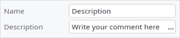
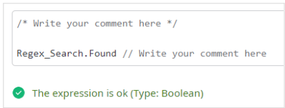
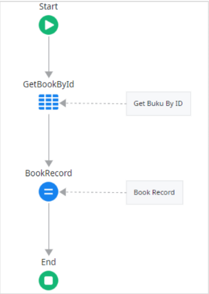

# Introduction

Komentar telah lama dianggap sebagai elemen penting dalam menulis kode. Namun dalam pendekatan Clean Code, komentar bukanlah sarana utama untuk membuat kode mudah dipahami, melainkan alat terakhir yang digunakan hanya jika memang benar-benar dibutuhkan. Tujuan utama dari Clean Code adalah menulis kode yang cukup jelas dan dapat menjelaskan dirinya sendiri tanpa bantuan komentar.

Komentar yang baik bisa membantu, tapi komentar yang buruk bisa membingungkan, salah arah, dan menambah beban pemeliharaan. Maka, kita perlu memiliki pandangan yang lebih bijak tentang bagaimana, kapan, dan mengapa komentar digunakan.

---
# Comment Viewpoints

Cara kita memandang komentar sangat menentukan bagaimana kita menggunakannya dalam praktik pengembangan perangkat lunak. Komentar bukanlah pelindung kode yang buruk, dan bukan pula pelengkap yang wajib ada dalam setiap bagian program.

## Bagaimana seharusnya memandang komentar?

- **Komentar tidak bisa memperbaiki bad code (kode yang buruk).** Menambahkan komentar pada kode yang berantakan hanya menutupi masalah, bukan memperbaikinya. Solusi sebenarnya adalah membuat kode yang baik.
    
- **Komentar adalah pilihan terakhir.** Fokus utama menulis kode yang bersih dan rapi (Clean Code), bukan menjelaskan sebuah bad code melalui komentar. Komentar hanya digunakan jika tidak ada cara lain yang lebih baik untuk menjelaskan maksudnya.
    
- **Setiap komentar yang ditulis adalah kegagalan dalam berekspresi.** Jika kita harus menjelaskan maksud kode dengan komentar, berarti kita gagal menyampaikan maksud itu langsung melalui struktur dan penamaan kode.
    
- **Komentar dapat berbohong dan tidak terawat.** Komentar yang awalnya benar bisa menjadi menyesatkan jika kode berubah, tetapi komentarnya tidak diperbarui. Ini membuat komentar bertentangan dengan kenyataan kode, sehingga justru membingungkan dan membahayakan pemahaman developer lain.
    
- **Clean code adalah kode yang bisa menjelaskan dirinya sendiri tanpa membutuhkan komentar tambahan**. Kode yang baik menggunakan nama fungsi, variabel, dan struktur logika yang jelas, sehingga pembaca bisa memahami maksudnya tanpa bantuan komentar.
    

---

# Technical Of Comments

Komentar memiliki bentuk dan fungsi yang beragam tergantung pada konteks dan platform. Dalam OutSystems, tersedia beberapa fitur khusus untuk mendukung dokumentasi dan penjelasan melalui komentar.

## Comments on OutSystems

Pada dasarnya, OutSystems mengadopsi berbagai bahasa seperti JavaScript, CSS, HTML, dan SQL. Oleh karena itu, OutSystems menyediakan beberapa cara utama untuk menyisipkan komentar sesuai konteks editor masing-masing.

1. **Comment Widget**

Komentar dalam bentuk widget, digunakan untuk memberi catatan di dalam alur logika (Flow) dalam Client Action atau Server Action. Cocok untuk memberi konteks lokal pada bagian logika yang kompleks atau penting.

2. **Description Field**

Tersedia pada hampir semua elemen dalam OutSystems seperti Actions, Entities, Variables, Parameters, dan Screens. Description berfungsi sebagai dokumentasi jangka panjang dan bersifat lebih formal.

3. **Expression Editor**

Komentar dapat ditulis menggunakan `/ /` untuk satu baris atau `/*  */` untuk beberapa baris, berfungsi untuk memberi catatan di dalam ekspresi logika atau perhitungan, membantu menjelaskan maksud atau fungsi bagian ekspresi tertentu.

4. **CSS Editor**

Menggunakan sintaks komentar di CSS membantu menjelaskan gaya atau struktur layout, tanpa mempengaruhi hasil tampilan akhir.

5. **SQL Editor**

Komentar dapat ditulis menggunakan -- untuk satu baris atau `/*  */` untuk beberapa baris, berguna untuk menjelaskan maksud query, parameter, atau bagian tertentu dari perintah SQL.

---
## Comments Classification

Dalam pengembangan sistem aplikasi modern, terutama pada lingkungan high-code seperti Visual Studio Code, ekstensi seperti **“Better Comments”** digunakan untuk mengklasifikasikan komentar berdasarkan warna. Dengan pengelompokan ini, komentar menjadi lebih mudah dibaca dan dipahami karena ditandai secara visual sesuai dengan jenis informasinya.

Tipe-tipe komentar pada klasifikasi “**Better Comments**”:

- **Title (Hijau Gelap)**: Menandai bagian utama atau blok penting kode.
    
- **Information (Hijau Tebal)**: Memberikan penjelasan tambahan tentang logika atau konteks tertentu.
    
- **Deprecation (Merah)**: Menunjukkan bahwa bagian kode tidak lagi disarankan untuk digunakan.
    
- **Question (Biru)**: Menandai keraguan atau pertanyaan terhadap suatu bagian logika.
    
- **TODO (Jingga)**: Bagian yang perlu diselesaikan atau diperbaiki di masa depan.
    
- **Parameters (Hijau Gelap dengan highlight biru untuk nama parameter)**: Memberikan penjelasan tentang argumen atau parameter fungsi.
    

> **Catatan:** Beberapa kode yang ditandai deprecated tetap dipertahankan untuk keperluan backward compatibility.

---
## Comments on Alignment Chart

Mengacu pada Alignment Chart, penulis Clean Code yaitu Robert C. Martin, mengklasifikasikan komentar sebagai bagian dari spektrum moral yang dikenal dengan istilah **“Lawful Evil”**.

- **Lawful**: Komentar memiliki struktur, aturan, dan mengikuti pedoman penulisan yang baik.  
- **Evil**: Komentar dapat:
	1. Menyembunyikan bad code	
	
	2. Kadaluarsa dan menyesatkan
	
	3. Membuat pemahaman yang salah
	
	4. Membutuhkan maintenance ekstra
	
	5. Bertentangan dengan implementasi sebenarnya

Hal ini berarti komentar mungkin terlihat sah secara struktur (lawful), tetapi sebenarnya bisa merugikan dalam jangka panjang (evil), terutama jika digunakan untuk membenarkan kode yang buruk alih-alih memperbaikinya

---
# Good Comments

Dalam prinsip Clean Code, komentar sebenarnya bukan hal yang ideal, mereka adalah kompromi. Namun, komentar yang benar-benar layak ditulis hanya muncul dalam kondisi tertentu yang memang dibutuhkan untuk memperjelas hal-hal yang tidak bisa disampaikan langsung oleh kode.

## Good Comments = Kosong

Perlu menjadi catatan penting bahwa, **komentar terbaik adalah tidak adanya komentar**. Jika kode ditulis dengan rapi, memiliki nama variabel yang deskriptif, fungsi yang terstruktur, dan alur logika yang jelas, maka kebutuhan akan komentar akan hilang. Tidak menulis komentar adalah tanda bahwa kode sudah cukup “berbicara sendiri” tanpa bantuan penjelasan tambahan.

## Good Comments are Written As LICET

Dalam kondisi tertentu komentar tetap bisa ditoleransi. Untuk memudahkan dalam menghafalkan prinsip Good Comments maka dibuat dengan akronim “***Good Comments are Written As LICET***”. Licet sendiri dalam bahasa latin artinya boleh-boleh saja. 

“Good Comments are **W**ritten **A**s **LICET**”, yaitu:

- **W – Warning of Consequences**, memberi peringatan konsekuensi dari aksi.
    
    
- **A – Amplification**, mempertegas bagian penting yang dapat terabaikan. Amplification masih berhubungan dengan Warning of Consequences. 

    
    
- **L – Legal**, menjelaskan informasi hukum atau lisensi, seperti hak cipta atau ketentuan open source.

    

- **I – Informative**, menyediakan informasi spesifik dan teknis yang tidak langsung terlihat dari kode.

    
    
- **C – Clarification**, menambahkan penjelasan untuk bagian kode yang kompleks dan sulit dimengerti secara langsung.

	
	
- **E – Explanation of Intent**, mengungkapkan maksud dan tujuan logika tertentu, mengapa sesuatu dilakukan, bukan bagaimana. Contoh: menjelaskan alasan / tujuan menggunakan Forge. 

	
- **T – TODO**, Menandai bagian yang belum selesai atau perlu ditinjau/ditambahkan nanti.
  
---
# Bad Comments

Komentar yang buruk tidak hanya tidak berguna, tapi juga dapat memperparah kebingungan dan mengurangi kualitas kode. Tipe komentar ini dikategorikan sebagai **Three-Un: Unclear, Unnecessary, dan Unhelpful**.

## 1. Unclear

Komentar yang tidak jelas atau membingungkan:

- **Curhatan pribadi atau bergumam**
	Komentar yang bersifat subjektif dan tidak memberikan informasi teknis apapun tentang kode. Seperti: “lagi malas coding” atau “semoga jalan terus”.  
	
  

- **Menyesatkan atau ambigu**
    Komentar yang tidak menggambarkan logika sebenarnya atau sudah tidak sesuai dengan implementasi.
    
    

- **Koneksi yang tidak jelas**
    Komentar yang tidak memiliki hubungan logis atau konteks yang jelas dengan kode yang dijelaskannya. 
    
    

## 2. Unnecessary

Komentar yang tidak perlu karena hanya mengulang isi dari kode:

- **Redundansi**
    Komentar yang hanya mengulangi apa yang sudah jelas dari nama variabel, fungsi, atau implementasi kode itu sendiri.
    
    
  

- **Bising atau polusi visual**
    Komentar dekoratif atau berlebihan yang tidak memberikan nilai informasi.
    
    
  

- **Penanda lokasi**
    Komentar yang sekadar menunjukkan lokasi atau bagian dari kode.
    
    
  

- **Atribusi**
    Komentar yang mencantumkan informasi seperti nama pembuat, tanggal, atau riwayat perubahan
    
    
  

| Catatan: Outsystems secara otomatis mencatat informasi pembuat dan pengubah terakhir suatu elemen, seperti Server Action, Client Action Variabel, Entity, dan Screen, memudahkan pelacakan riwayat perubahan. |  |
| ------------------------------------------------------------------------------------------------------------------------------------------------------------------------------------------------------------- | -------------------------- |

---

## 3. Unhelpful

Komentar yang panjang, melebar, atau tidak relevan:

- Terlalu banyak informasi
    Komentar yang terlalu panjang, kompleks, dan detail, sehingga justru mempersulit pembacaan dan pemahaman kode.
    
    

- Informasi non-lokal
    Komentar yang membahas konteks atau informasi di luar lingkup kode yang sedang dikerjakan.
    
    

---

# Kesimpulan

Dalam prinsip Clean Code, komentar sebaiknya menjadi pilihan terakhir, bukan alat utama untuk menjelaskan kode. Kode yang baik harus bisa “berbicara sendiri” melalui penamaan dan struktur yang jelas. Komentar yang tidak tepat bisa menyesatkan, menambah beban pemeliharaan, dan menyembunyikan kode buruk. Namun, komentar tetap diperbolehkan dalam kondisi tertentu seperti penjelasan intent, peringatan, informasi hukum, atau TODO. Komentar buruk biasanya bersifat tidak jelas, tidak perlu, atau tidak membantu. Maka, tulislah komentar hanya jika benar-benar dibutuhkan dan tidak ada cara lain untuk memperjelas maksud kode.

> ***“Truth can only be found in one place: the code. Only the code can truly tell you what it does. It is the only source of truly accurate information.”***
