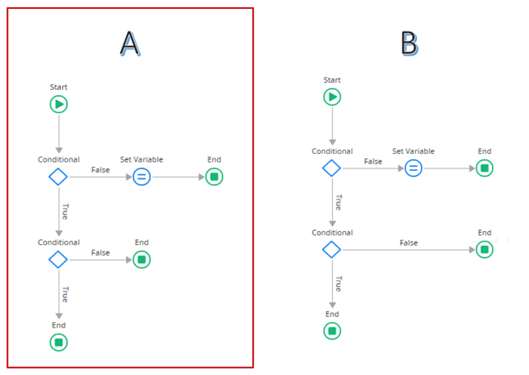
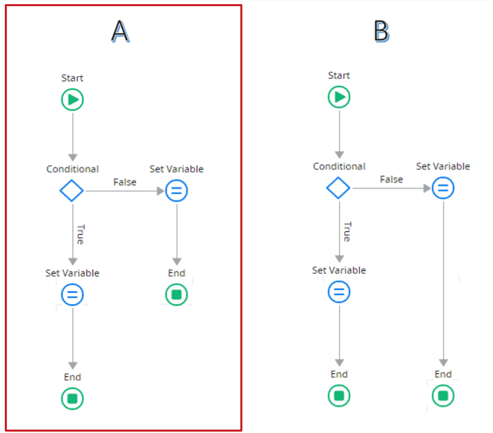
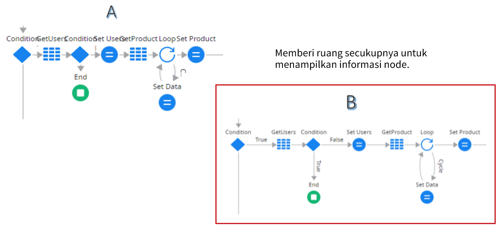
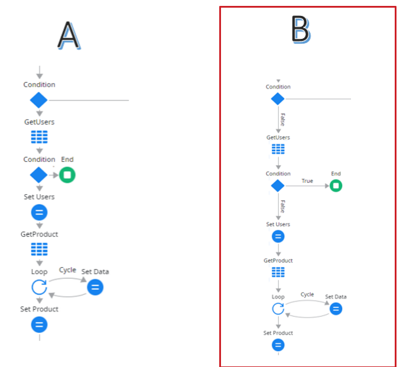
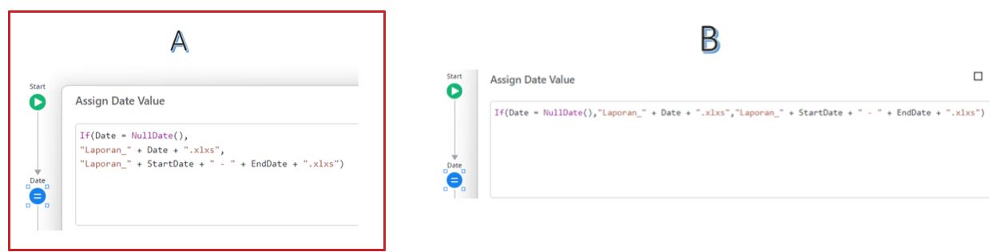
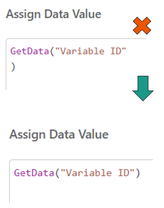
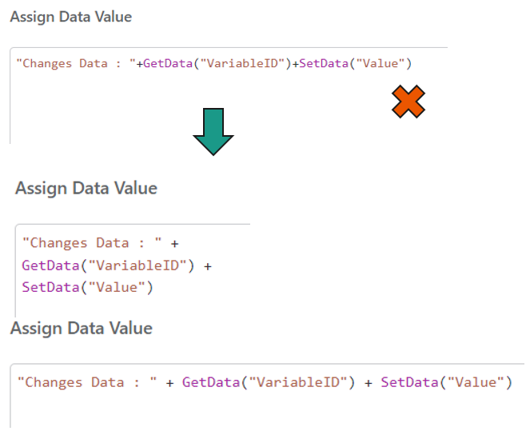
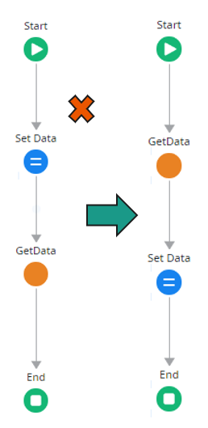
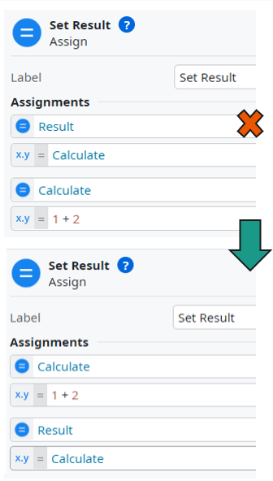

# Introduction

Formatting adalah proses pengaturan tata letak dan penyajian kode agar **lebih** **mudah dibaca** dan **dipahami**. Formatting mencakup berbagai aspek, seperti:

- **Indentasi** (penggunaan spasi atau tab untuk menunjukkan hierarki struktur kode).
- **Spasi antar elemen kode** untuk meningkatkan keterbacaan.
- **Pemisahan baris kode** untuk memisahkan bagian-bagian kode yang memiliki fungsi berbeda.
- **Struktur keseluruhan kode** agar lebih mudah dinavigasi oleh pengembang.

---
## Tujuan Formatting

Formatting bukan sekadar membuat kode terlihat rapi, tetapi juga memiliki tujuan yang lebih luas dalam pengembangan perangkat lunak, yaitu:

1. **Meningkatkan keterbacaan kode**
	- Kode lebih sering dibaca daripada ditulis, sehingga tampilan yang terstruktur mempermudah pemahaman.

2. **Mempermudah pemeliharaan kode**
    - Pengembang lain dapat dengan cepat memahami dan memodifikasi kode tanpa resiko besar.

3. **Meningkatkan efisiensi kolaborasi**
    - Dengan mengikuti standar formatting yang sama, pengembang dapat bekerja bersama tanpa hambatan pemahaman.

4. **Mengurangi kesalahan dalam kode**
    - Struktur yang rapi membantu dalam mendeteksi bug lebih cepat.
    

5. **Mempermudah proses code review**
    - Reviewer dapat lebih fokus pada logika program dibanding mengoreksi format kode yang tidak konsisten.

---
## Pentingnya Formatting

### 1. Readability

Kode yang terformat dengan baik **lebih mudah dibaca dan dipahami**, sehingga pengembang dapat dengan cepat memahami alur logika program. Formatting yang baik mengurangi waktu yang dibutuhkan untuk memahami fungsi dan tujuan kode tertentu.

### 2. Maintainability

Kode yang memiliki format konsisten **lebih mudah dipelihara**. Formatting yang buruk dapat menyebabkan kesulitan dalam mencari, memperbaiki, atau memperbarui bagian kode tertentu.

### 3. Collaboration

Dalam proyek pengembangan perangkat lunak, beberapa pengembang sering bekerja pada kode yang sama. Dengan mengikuti standar formatting yang sama, setiap pengembang **dapat memahami dan mengedit kode dengan lebih mudah** tanpa harus menyesuaikan diri dengan format yang berbeda-beda.

### 4. Error Reduction

Kode yang tidak terstruktur dengan baik sering kali menyebabkan kesalahan yang sulit ditemukan. Dengan mengikuti formatting yang jelas, pengembang dapat **lebih mudah mendeteksi kesalahan dan memperbaikinya sebelum menyebabkan bug yang lebih besar**.

### 5. Code Reviews

Saat melakukan review kode, reviewer seharusnya fokus pada logika dan fungsionalitas, bukan pada masalah format kode yang tidak rapi. Formatting yang baik **mempermudah proses review** karena kode lebih mudah dianalisis dan dipahami.

---

## Perbedaan Formatting dan Refactoring

Meskipun sering dianggap sama, formatting dan refactoring adalah dua hal yang berbeda:

| Aspek    | Formatting                                                                                                                                 | Refactoring                                                                                                                                                                                                  |
| -------- | ------------------------------------------------------------------------------------------------------------------------------------------ | ------------------------------------------------------------------------------------------------------------------------------------------------------------------------------------------------------------ |
| Definisi | Mengatur tata letak dan gaya penulisan kode agar lebih mudah dibaca tanpa mengubah fungsionalitasnya.                                      | Mengubah struktur internal kode untuk meningkatkan kualitas tanpa mengubah fungsionalitas.                                                                                                                   |
| Fokus    | Konsistensi dalam indentasi, spasi, pemisahan baris (line breaks), dan gaya penulisan.                                                     | Meningkatkan desain kode, mengurangi duplikasi, dan meningkatkan efisiensi.                                                                                                                                  |
| Contoh   | - Mengubah indentasi atau spasi.      - Menyesuaikan panjang baris kode.      - Menggunakan konvensi penamaan yang lebih baik. | - Mengganti kode berulang dengan fungsi yang dapat digunakan kembali.      - Memisahkan fungsi besar menjadi fungsi kecil yang lebih spesifik.      - Menghilangkan dependensi yang tidak perlu. |
| Dampak   | Meningkatkan keterbacaan kode tanpa mengubah cara kerja kode tersebut.                                                                     | Membantu pemeliharaan jangka panjang, meningkatkan efisiensi, dan mengurangi potensi bug.                                                                                                                    |

---
## Formatting dalam OutSystems

Dalam lingkungan pengembangan OutSystems, formatting memainkan peran penting dalam meningkatkan keterbacaan dan pemeliharaan aplikasi. Berdasarkan hasil survei kebiasaan pengembang di lingkungan PPU, berikut adalah beberapa aspek formatting yang umum diterapkan:

### 1. Alignment (Penyelarasan)

Kode yang disusun secara horizontal dan vertikal dengan rapi akan lebih mudah dibaca dan dipahami. Alignment sering digunakan dalam:

- **Assignment** (pemberian nilai ke variabel).
- **Conditional statements** (struktur logika IF/ELSE).
- **Node dalam OutSystems untuk** memastikan aliran logika terlihat jelas.

**Contoh Formatting Alignment:**

Alignment dalam flowchart memastikan keterbacaan yang lebih baik. Berikut dua jenis alignment yang umum diterapkan:

1. **Horizontal Alignment**

- **A (Alignment yang Rapi)** → End Node disusun sejajar, sehingga aliran logika lebih jelas dan mudah dipahami.
- **B (Tanpa Alignment yang Baik)** → End Node tidak sejajar, menyebabkan struktur flow lebih sulit diikuti.

2. **Vertical Alignment**

- **A (Alignment yang Rapi)** → End Node disusun sejajar, sehingga aliran logika lebih jelas dan mudah dipahami.
- **B (Tanpa Alignment yang Baik)** → End Node tidak sejajar, menyebabkan struktur flow lebih sulit diikuti.

📌 **Kesimpulan:**
Berdasarkan survei, mayoritas developer di lingkungan PPU **memilih A**, **Formatting yang lebih rapi dengan horizontal dan vertical alignment** untuk meningkatkan keterbacaan dan efektivitas kolaborasi dalam pengembangan aplikasi OutSystems.

---
### 2. Openness and Density (Kerapatan dan Keterbukaan)

Kode harus memiliki ruang yang cukup antar elemen agar tidak terlihat terlalu padat.

**Contoh Formatting Openness and Density:**

Openness dan Density dalam flowchart berpengaruh pada keterbacaan serta pemahaman alur logika. Tujuannya memberikan ruang horizontal yang cukup untuk informasi pada setiap node agar lebih mudah dibaca dan dipahami. Berikut adalah dua pendekatan yang digunakan:

1. **Horizontal Openness and Density**

- **A (Terlalu Padat)** → Node diletakkan berdekatan, menghemat ruang tetapi bisa mengurangi keterbacaan.
- **B (Memberikan Ruang yang Cukup)** → Memberi ruang lebih antara node, sehingga lebih jelas dalam menampilkan informasi.

2. **Vertical Openness and Density**

- **A (Terlalu Padat)** → Node diletakkan berdekatan, menghemat ruang tetapi bisa mengurangi keterbacaan.
- **B (Memberikan Ruang yang Cukup)** → Memberi ruang lebih antara node, sehingga lebih jelas dalam menampilkan informasi.

📌 **Kesimpulan:**
Berdasarkan survei, mayoritas developer di lingkungan PPU **memilih B**, **Formatting yang memberikan ruang yang cukup dengan horizontal dan vertikal openness and density** dalam flowchart untuk meningkatkan keterbacaan, pemahaman logika, serta mempermudah kolaborasi dalam pengembangan aplikasi OutSystems.

---
### 3. Distance (Jarak Antar Elemen Kode)

Jarak antar elemen kode yang penting harus dijaga agar alur logika lebih jelas.

**Contoh Formatting Distance dalam Flowchart:**

Distance dalam flowchart mempengaruhi keterbacaan dan pemahaman alur logika. Tujuannya adalah mengelompokkan node yang memiliki keterkaitan agar lebih mudah dibaca tanpa mengorbankan efisiensi ruang. Berikut adalah dua pendekatan yang digunakan:

1. **Horizontal Distance**

- **A (Kelompok Berdasarkan Jenis Operasi)**
    - **Get Data (Pengambilan Data) dikelompokkan lebih dahulu** → GetUsers dan GetProduct ditempatkan berdampingan.
    - **Set Data (Pemrosesan Data) dikelompokkan berikutnya** → SetUsers dan SetProduct ditempatkan setelahnya.  

- **B (Kelompok Berdasarkan Alur Logika)**
	- **Get dan Set yang berkaitan diletakkan berdekatan** → Misalnya, GetUsers langsung diikuti oleh SetUsers, dan GetProduct langsung diikuti oleh SetProduct.
	- **Menghindari pemisahan yang tidak relevan**, sehingga alur lebih natural tanpa melewati node yang tidak berhubungan.
    

2. **Vertical Distance**

- **A (Kelompok Berdasarkan Jenis Operasi)**
	- Sama seperti horizontal, GetUsers dan GetProduct berada dalam satu bagian di atas.
	- SetUsers dan SetProduct berada di bawahnya.  

- **B (Kelompok Berdasarkan Alur Logika)**
	- **Langsung menghubungkan node Get dan Set yang berhubungan** → Misalnya, GetUsers langsung diikuti oleh SetUsers, dan GetProduct diikuti oleh SetProduct.
	- **Mencegah alur yang terlalu panjang dan tidak perlu.**

📌 **Kesimpulan:**
Berdasarkan survei, mayoritas developer di lingkungan PPU **memilih B (Kelompok Berdasarkan Alur Logika**.

- **Mengelompokkan Get dan Set yang berkaitan dalam satu jalur** meningkatkan keterbacaan dan pemahaman logika.
- **Pemrosesan lebih efisien** tanpa perlu melewati node yang tidak relevan.
- **Format ini lebih mudah digunakan dalam pengembangan aplikasi OutSystems** karena alur logika lebih jelas.

---
### 4. Vertical Openness Between Concepts

Bagian kode dengan logika yang berbeda harus dipisahkan dengan baris kosong agar lebih mudah dipahami.

**Contoh Formatting Vertical Openness Between Concepts:**

**Vertical Openness Between Concepts** berpengaruh pada keterbacaan serta pemahaman alur logika dalam kode. Tujuannya adalah memberikan ruang vertikal yang cukup untuk memisahkan bagian kode yang memiliki konsep atau logika berbeda agar lebih mudah dibaca dan dipahami. Berikut adalah dua pendekatan yang digunakan:

- **A (Memberikan Ruang yang Cukup)**
	- Memisahkan ekspresi ke dalam beberapa baris untuk meningkatkan keterbacaan.
	- Jarak yang cukup antara elemen logika berbeda agar lebih jelas dan mudah dipahami.
	- Mempermudah debugging karena struktur kode lebih rapi.      

- **B (Terlalu Padat)**
	- Semua kode ditulis dalam satu baris panjang, sulit dibaca.
	- Tidak ada pemisahan logika yang jelas.
	- Menyulitkan debugging jika terjadi kesalahan dalam kode.

**📌 Kesimpulan:**
Berdasarkan survei, mayoritas developer di lingkungan PPU **memilih pendekatan A, Formatting yang memberikan ruang vertikal** yang cukup yang dapat meningkatkan keterbacaan, pemahaman logika, serta mempermudah kolaborasi dalam pengembangan aplikasi.

---
### 5. Dummy Scopes

Bagian kode yang hanya berfungsi untuk memenuhi struktur sintaksis atau menghindari error kompilasi.

**Contoh Formatting Dummy Scopes:**

**Dummy Scopes** adalah bagian kode yang tidak memiliki **fungsi atau tujuan yang jelas**, selain untuk memenuhi struktur sintaksis atau menghindari kesalahan kompilasi. Namun, jika tidak ditangani dengan baik, dummy scopes dapat mengurangi efisiensi dan keterbacaan kode.

1. **Dummy Scopes yang Tidak Efektif ❌**
	- Menambahkan karakter yang tidak diperlukan, seperti baris kosong atau indentasi berlebihan.
	- Tidak memberikan manfaat tambahan bagi pemahaman kode.
	- Dapat menyebabkan kebingungan atau redundansi dalam debugging.

2. **Dummy Scopes yang Efektif ✅**
	- Menuliskan kode secara langsung tanpa tambahan elemen yang tidak perlu.
	- Memastikan struktur tetap rapi tanpa mengorbankan keterbacaan.
	- Mengoptimalkan penggunaan kode agar lebih ringkas dan mudah dipahami.

📌 **Kesimpulan:**
Berdasarkan survei, mayoritas developer di lingkungan PPU **memilih pendekatan Tanpa Dummy Scopes** yang tidak diperlukan untuk menjaga efisiensi, keterbacaan, dan kualitas kode.

---
### 6. Indentation (Indentasi)

Menggunakan spasi atau tab di awal baris untuk menunjukkan hierarki kode.

**Contoh Formatting Indentation:**

**Indentation** adalah format dengan **menambahkan spasi atau tab di awal baris kode** untuk menunjukkan **struktur atau hierarki** dalam kode. Penggunaan indentation yang baik meningkatkan keterbacaan dan mempermudah pemahaman alur logika kode.

1. **Indentation yang Tidak Efektif ❌**
	- Kode ditulis dalam satu baris panjang tanpa pemisahan yang jelas.
	- Sulit untuk membaca dan memahami hubungan antar elemen kode.
	- Menyulitkan proses debugging dan maintenance kode.

2. **Indentation yang Efektif ✅**
	- Setiap elemen logika kode dipisahkan dengan indentasi yang sesuai.
	- Struktur kode lebih jelas dan mudah dibaca.
	- Mempermudah proses debugging serta meningkatkan efisiensi pengembangan.

📌**Kesimpulan:**
Berdasarkan survei, mayoritas developer di lingkungan PPU **memilih pendekatan Indentation yang rapi dan jelas** untuk meningkatkan keterbacaan, pemahaman logika, dan kemudahan dalam kolaborasi.

---
### 7. Ordering (Pengurutan Elemen Kode)

Menyusun elemen kode dalam urutan logis, misalnya:

- Mendefinisikan variabel sebelum digunakan.
- Menyusun metode berdasarkan urutan panggilannya.

**Contoh Formatting Ordering:**

**Ordering** adalah teknik menyusun **elemen dalam urutan logis**, seperti mendefinisikan variabel sebelum menggunakannya atau menyusun metode berdasarkan urutan panggilannya. Penggunaan ordering yang baik memastikan kode lebih mudah dipahami dan dieksekusi dengan benar.

**Ordering dalam Logic Flow pada OutSystems**

Ordering dalam logic flow memastikan bahwa setiap langkah dieksekusi dalam urutan yang logis dan efisien.

1. **Urutan yang Tidak Efektif ❌**
	- Meletakkan **Set Data** sebelum **GetData** menyebabkan data yang di-set mungkin tidak relevan.
	- Mengurangi keterbacaan dan dapat menyebabkan hasil yang tidak diinginkan.    

2. **Urutan yang Efektif ✅**
	- **GetData** ditempatkan sebelum **Set Data**, memastikan bahwa data yang digunakan valid.
	- Mempermudah debugging dan meningkatkan efisiensi eksekusi.

**Ordering dalam Assignments pada OutSystems**

Urutan assignment juga berpengaruh pada hasil perhitungan dan keterbacaan kode.

1. **Urutan Assignment yang Tidak Efektif ❌**
	- **Result** dideklarasikan sebelum semua variabel pendukungnya (misalnya, Calculate).
	- Membingungkan karena variabel yang digunakan dalam hasil belum didefinisikan.    

2. **Urutan Assignment yang Efektif ✅**
	- Variabel dihitung terlebih dahulu sebelum digunakan dalam assignment lainnya.
    - **Calculate** dibuat sebelum **Result**, memastikan bahwa semua variabel telah memiliki nilai yang benar sebelum digunakan.
    

📌 **Kesimpulan:** 
Mengatur urutan secara logis membantu menjaga efisiensi kode, mempermudah debugging, dan meningkatkan keterbacaan dalam OutSystems.

---
## Formatting Rules dari Uncle Bob

Robert C. Martin (Uncle Bob), seorang ahli dalam clean code, memberikan beberapa aturan formatting yang penting untuk diikuti:

### 1. Jangan Menyimpan Kode yang Tidak Terpakai

- Hapus kode yang tidak digunakan agar kode tetap bersih dan mudah dipahami.
- Kode yang tidak terpakai hanya akan menambah kebingungan bagi pengembang lain.

### 2. Gunakan Format yang Memudahkan Perubahan

- Formatting harus mendukung perubahan yang cepat dan efisien.
- Struktur kode harus memungkinkan modifikasi tanpa mengacaukan keseluruhan sistem.

### 3. Jaga Agar Kode Tetap Bersih

- Gunakan prinsip **Boy Scout Rule**: Tinggalkan kode dalam kondisi lebih baik daripada yang ditemukan.
- Setiap kali melakukan perubahan, pastikan formatting tetap terjaga.

---
## Kesimpulan

Formatting dalam kode sangat penting untuk meningkatkan **readability**, **maintainability**, **collaboration**, **error reduction**, dan **code reviews**. Dalam lingkungan seperti OutSystems, menerapkan prinsip formatting yang baik akan membantu pengembang bekerja lebih efisien dan kolaboratif.

Seperti kata **Uncle Bob**:

> ***"Code formatting is about communication, and communication is the professional developer's first order of business."***

Dengan menerapkan prinsip formatting yang baik, kita dapat menulis kode yang lebih bersih, lebih mudah dipahami, dan lebih mudah dikelola dalam jangka panjang. 
